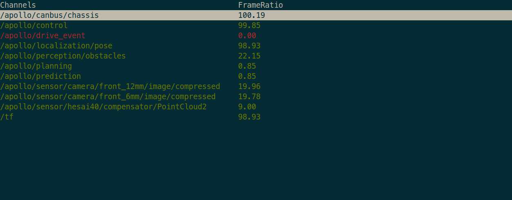

# 百度Apollo

[百度Apollo](https://www.apollo.auto/)是一款[开源](https://github.com/ApolloAuto/apollo)的工业级自动驾驶系统。本文档简要介绍了Apollo中与课程实验紧密相关的模块和工具。

## 1. Dreamview
Dreamview是Apollo官方提供的web程序，为用户提供了图形化的车辆状态监测和调试页面。更详细的信息请参考[Dreamview文档](https://developer.apollo.auto/Apollo-Homepage-Document/Apollo_Doc_CN_6_0/%E5%BF%AB%E9%80%9F%E4%B8%8A%E6%89%8B/Dreamview%E7%AE%80%E4%BB%8B/)。

[启动Dreamview](https://developer.apollo.auto/Apollo-Homepage-Document/Apollo_Doc_CN_6_0/%E5%BF%AB%E9%80%9F%E4%B8%8A%E6%89%8B/%E4%BD%BF%E7%94%A8Dreamview%E6%9F%A5%E7%9C%8B%E6%95%B0%E6%8D%AE%E5%8C%85)：
```bash
cd apollo/docker/scripts
sudo bash dev_start.sh -l # 启动Apollo容器
sudo bash dev_into.sh # 进入Apollo容器

# Apollo容器内
./scripts/bootstrap.sh # 运行Dreamview
```
在浏览器中输入`http://localhost:8888`，即可访问Dreamview页面。

## 2. CyberMonitor
命令行工具[CyberMonitor](https://developer.apollo.auto/Apollo-Homepage-Document/Apollo_Doc_CN_6_0/%E4%B8%8A%E6%9C%BA%E4%BD%BF%E7%94%A8%E6%95%99%E7%A8%8B/%E5%AE%9E%E6%97%B6%E9%80%9A%E4%BF%A1%E6%A1%86%E6%9E%B6CyberRT%E7%9A%84%E4%BD%BF%E7%94%A8/%E4%BD%BF%E7%94%A8CyberMonitor%E6%9F%A5%E7%9C%8BChannel%E6%95%B0%E6%8D%AE%E5%AE%9E%E8%B7%B5/)提供了终端中实时显示channel信息列表的功能。

常用操作：
```bash
ESC | q key ---- 退出
Backspace ---- 后退
h | H ---- 显示帮助页
PageDown | Ctrl+d ---- 上一页
PageUp | Ctrl+u ---- 下一页
Up, down or w, s keys ---- 上下移动当前的高亮行
Right arrow or d key ---- 进入高亮行, 显示高亮行数据的详细信息
Left arrow or a key ---- 从当前界面返回上一层界面
Enter key ---- 与 d 键相同
f | F ---- 显示数据帧频率
t | T ---- 显示 channel 消息类型
Space ---- 关闭|开启 channel (仅在 channel 有数据到达时有效；channel 关闭后会变成黄色)
i | I ---- 显示 channel 的 Reader 和 Writer 信息
b | B ---- 显示 channel 消息内容
n | N ---- 显示消息中 RepeatedField 的下一条数据
m | M ---- 显示消息中 RepeatedField 的上一条数据
```


## 3. CyberRT
CyberRT是Apollo的实时通信框架，相关资料：

- [官方文档](https://developer.apollo.auto/Apollo-Homepage-Document/Apollo_Doc_CN_6_0/%E4%B8%8A%E6%9C%BA%E4%BD%BF%E7%94%A8%E6%95%99%E7%A8%8B/%E5%AE%9E%E6%97%B6%E9%80%9A%E4%BF%A1%E6%A1%86%E6%9E%B6CyberRT%E7%9A%84%E4%BD%BF%E7%94%A8/CyberRT%E4%BB%8B%E7%BB%8D/)
- [开源Python库-pycyber](https://github.com/daohu527/pycyber)