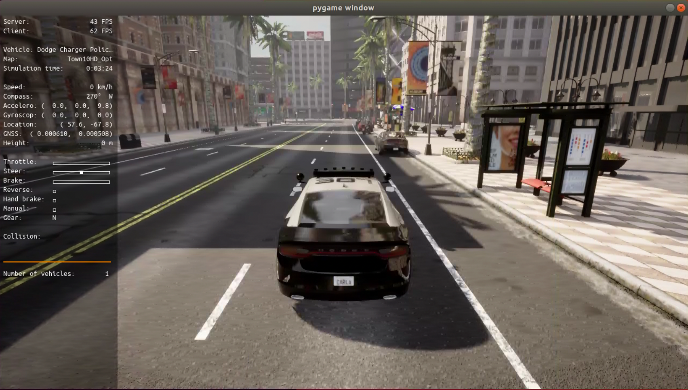
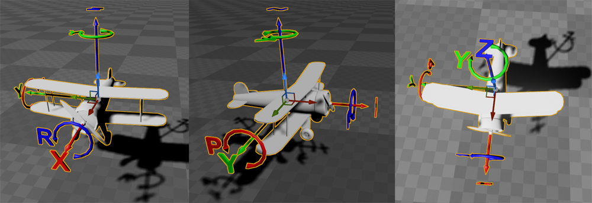
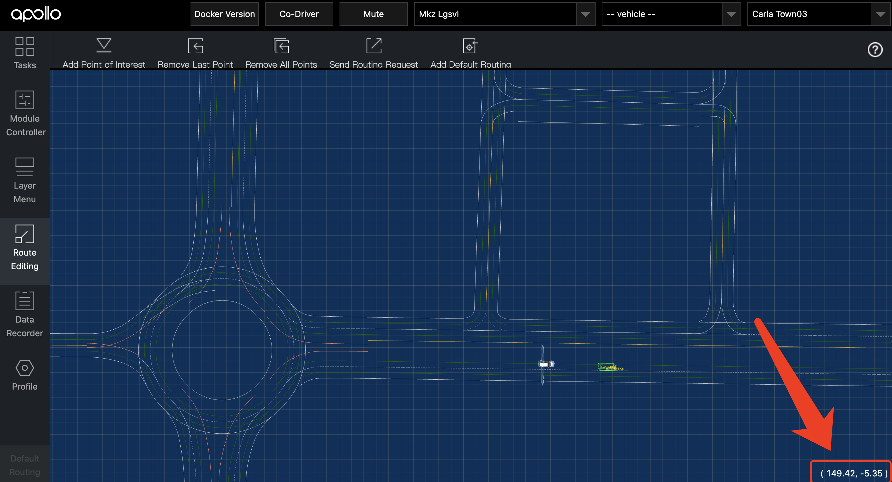

# Carla模拟器

[Carla](https://carla.org/)是一款基于[Unreal Engine](https://www.unrealengine.com/zh-CN)的自动驾驶仿真器，类似于一个**逼真的**赛车游戏。Carla为用户提供了[Python API](https://carla.org/)，你可以通过这些API实现各种各样的脚本，用于测试自动驾驶系统。

我们已经为你准备好了一些Python脚本（在bridge的`scripts/`目录下），你可以直接使用这些脚本生成场景。如果你想在更加复杂的场景中测试，也可以自己开发新的Python脚本。下面我们将介绍这些脚本的使用方法。

## 1. 手动控制车辆
`manual_control.py`是Carla官方提供的脚本，可以在Carla世界中生成主车，并由用户手动控制（和游戏一样，用WSAD键移动）。

在manual_control的pygame页面按`H`可以查看各个按键的功能，下面介绍几个常用按键：
```
H                   : 查看帮助
Q                   : 切换前进/倒车模式
Backspace (删除键)   : 切换主车车型
P                   : 开启自动驾驶模式
ESC                 : 退出
```

## 2. 设置场景的天气
可以使用`set_weather.py`设置当前Carla世界中场景的天气，可以调整的参数包括降雨、积水、太阳高度角、雾浓度等，参数的具体含义请参考[Carla官方文档-WeatherParameters](https://carla.readthedocs.io/en/latest/python_api/#carla.WeatherParameters)。

对自动驾驶系统影响比较大的参数是雾浓度、太阳高度角、积水，下面是一个示例：
```bash
cd scripts
# 查看参数说明
python set_weather.py -h
# 设置雾浓度为50%，设置太阳高度角为-90°
python set_weather.py -f 50 -s -90
```

## 3. 移动主车
移动主车的脚本是`move_ego.py`，用于将主车移动到指定的坐标位置（当然，要先运行`bridge_with_ego.py`或`manual_control.py`才有主车）。`move_ego.py`的参数是Carla坐标系的坐标，包括`(x, y, z, pitch, yaw, roll)`。其中`(x, y, z)`是主车的位置，以米为单位，而`(pitch, yaw, roll)`是主车的方向（参考[carla.Rotation](https://carla.readthedocs.io/en/latest/python_api/#carlarotation)），以度为单位，如下图所示。



当需要将主车移动到指定位置时，可以在[Apollo Dreamview](apollo.md)的“Route Editing”中用鼠标指向地图中的位置，并在页面右下角查看坐标。



!!! warning "注意"
    Apollo与Carla的坐标系是不一样的，**两者的y坐标互为相反数**。因此，想要将主车移动到Apollo Dreamview页面中看到的`(x=10, y=20)`位置时，`move_ego.py`的输入参数应为`(x=10, y=-20)`。

当车辆不在斜坡上时，`pitch`和`roll`都应设置为0，只需要设置`yaw`以调整车头朝向。例如：
```bash
cd scripts
# 查看参数说明
python move_ego.py -h
# 移动主车
python move_ego.py -x -31.08 -y 134.57 --yaw=0
```

## 4. 生成静止的NPC车辆
使用`spawn_npc.py`在主车附近生成静止的NPC车辆。`-t`参数可以指定NPC的车型，参数的范围是Carla预制的[车辆](https://carla.readthedocs.io/en/latest/catalogue_vehicles/)和[行人](https://carla.readthedocs.io/en/latest/catalogue_pedestrians/)。
```bash
cd scripts
# 在主车前方20米，右方2米处生成一辆特斯拉Model3
python spawn_npc.py -f 20 -r 2 -t "vehicle.tesla.model3"
```

## 5. 生成随机动态交通流
Carla官方提供的脚本`generate_traffic.py`可以在地图中生成随机的动态交通流，生成的所有车辆都是自动驾驶的。最好使用`--hybrid`参数，当NPC不在主车附近时不使用物理引擎计算，减小仿真的开销。
```bash
cd scripts
# 随机生成40辆车和10个行人
python generate_traffic.py -n 40 -w 10 --hybrid
```