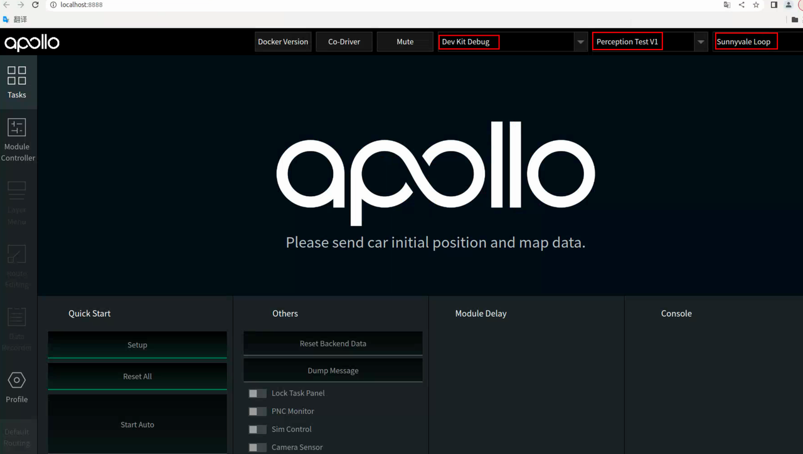
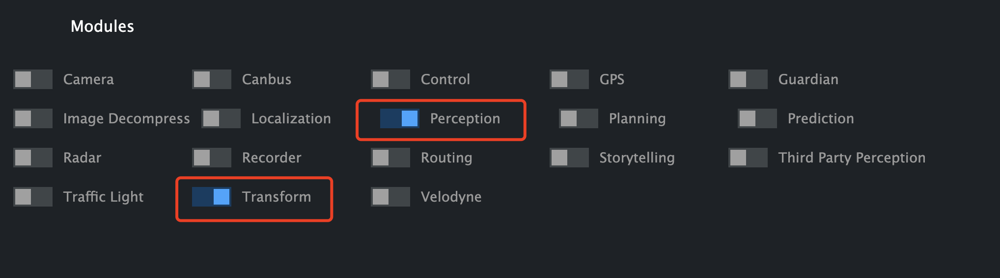
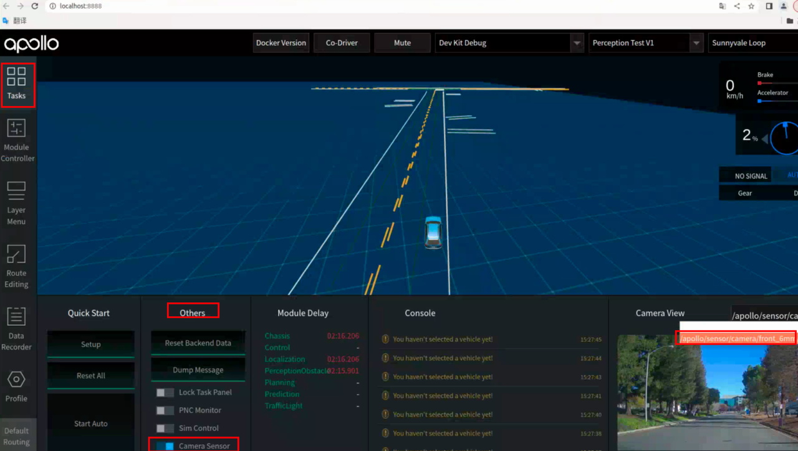
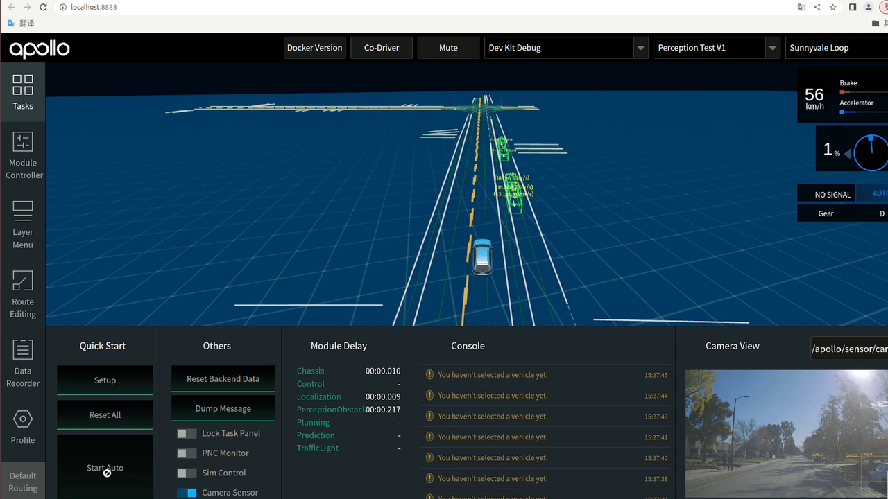
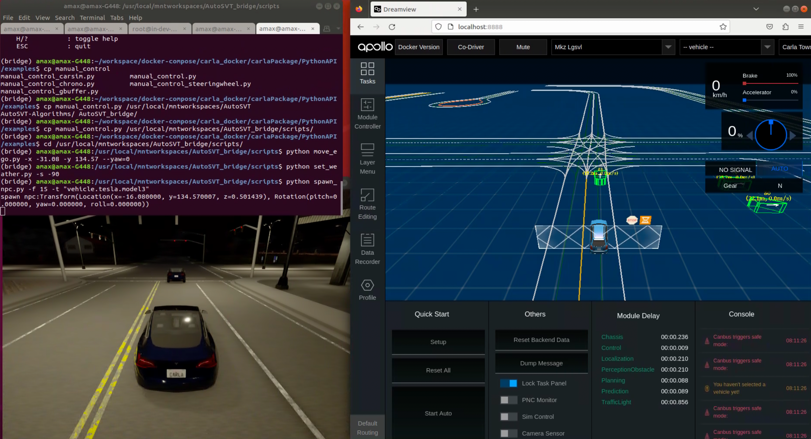

# 实验步骤

# 任务一：部署感知模型
### step1: 进入apollo容器
```bash
cd apollo 
sudo bash ./docker/scripts/dev_start.sh   # 首次运行后，加-l参数可以节省时间
sudo bash ./docker/scripts/dev_into.sh
```

### step2: 安装模型
通过以下命令把训练好的模型部署到Apollo，其中`SMOKE_paddle.zip`是训练好的模型打包文件。执行完成命令之后，提示安装成功，则表示模型安装成功。
```bash
python3 modules/tools/amodel/amodel.py install SMOKE_paddle.zip
```
模型部署工具使用方式可以参考 **/apollo/modules/tools/amodel/readme.md**。

### step3: 修改配置文件
模型文件会被安装至`/apollo/modules/perception/production/data/perception/camera/models/yolo_obstacle_detector/`目录下，修改该路径下的 smoke-config.pt 配置文件中的下述内容：
```yaml
model_param {
  model_name: "./3d-r4-half_caffe"
  model_type: "PaddleNet"
  weight_file: "../SMOKE_paddle/smoke.pdiparams"
  proto_file: "../SMOKE_paddle/smoke.pdmodel"
  anchors_file: "anchors.txt"
  types_file: "types.txt"
  calibratetable_root: "./3d-r4-half_caffe"
  confidence_threshold: 0.25
  offset_ratio: 0.0
  cropped_ratio: 1.185185185185
  resized_width: 960
  aligned_pixel: 32
  min_2d_height: 10
  min_3d_height: 0.1
  ori_cycle: 1
  with_box3d: true
  light_swt_conf_threshold: 0
  light_vis_conf_threshold: 0
  with_lights: false
  with_ratios: false
  # num_areas: 4
  border_ratio: 0.01
}
net_param {
  det1_loc_blob: "concat_8.tmp_0"
  det1_obj_blob: "obj_pred"
  det1_cls_blob: "cls_pred"
  det1_ori_blob: "ori_pred"
  det1_dim_blob: "dim_pred"
  input_data_blob: "images"
  input_ratio_blob: "down_ratios"
  input_instric_blob: "trans_cam_to_img"
  feat_blob: "conv3_3"
}
nms_param {
  type: "NormalNMS"
  threshold: 0.5
  sigma: 0.4
  inter_cls_nms_thresh: 0.6
}
```

## 运行感知模块
### step4: 启动Apollo DreamView
在Apollo容器内启动DreamView。
```bash
bash scripts/bootstrap.sh 
```
打开浏览器输入`http://localhost:8888/`地址出现DreamView页面，选择正确的模式、车型、地图。


### step5: 启动Perception和Transform模块
点击DreamView页面左侧状态栏Module Controller，开启Perception和Transform。

或在终端启动：
```bash
source /apollo/cyber/setup.bash
cyber_launch start /apollo/modules/transform/launch/static_transform.launch

# 打开新终端，重新用dev_into.sh进入Apollo容器
source /apollo/cyber/setup.bash
mainboard -d /apollo/modules/perception/production/dag/dag_streaming_perception_camera.dag
```

## 基于数据包验证感知结果
### step6: 播放测试数据包
```bash
# Apollo容器内
source /apollo/cyber/setup.bash
# 需要使用 -k 参数屏蔽掉数据包中包含的感知通道数据
cyber_recorder play -f ./data/bag/sensor_rgb.record -k /apollo/sensor/camera/front_12mm/image /apollo/sensor/camera/rear_6mm/image /perception/vehicle/obstacles /apollo/prediction/perception_obstacles /apollo/perception/obstacles /perception/obstacles /apollo/prediction
```

### step7: 查看感知结果
将DreamView Tasks中的Camera Sensor按钮打开，在Camera View中选择相应的相机通道数据。



## 任务二：基于Carla和Apollo联合仿真验证感知结果
### step8: 退出并关闭Apollo
```bash
# Apollo容器内
exit # 退出Apollo容器
bash ./docker/script/dev_start.sh stop
```

### step9: 启动联合仿真环境
TODO: 配置Apollo，启动bridge步骤。

### step10: 通过静止NPC车辆测试感知模块
我们提供了一些[Carla Python脚本](../background/carla.md)用于生成场景。下面给出一个示例，你可以根据自己的想法调整场景的参数。
```bash
cd scripts
# 移动主车到十字路口
python move_ego.py -x -31.08 -y 134.57 --yaw=0
# 将环境调整为夜晚
python set_weather.py -s -90
# 在主车前方生成一辆Tesla Model 3
python spawn_npc.py -f 15 -t "vehicle.tesla.model3"
```
用DreamView或[CyberMonitor](../background/apollo.md)查看感知结果。



### step11: 在动态交通流中测试感知模块
用`generate_traffic.py`生成动态的交通流。
```bash
cd scripts
# 随机生成40辆车和10个行人
python generate_traffic.py -n 40 -w 10 --hybrid
```