# 任务0：熟悉Apollo planning模块（2学时）

## 实验目的

&emsp;&emsp;(1) 熟悉 Apollo 软件系统的启动方法，掌握 Dreamview 交互系统使用

&emsp;&emsp;(2) 熟悉 Apollo 软件系统工作流程，掌握系统调试工具的 cyber_monitor 使用

&emsp;&emsp;(3) 掌握通过 sim_control模块对 Apollo 软件代码的仿真调试方法

## 实验步骤

### 总体流程


### 具体步骤
（1）启动 DreamView 可视化交互系统
在 Ubuntu 系统中打开命令行工具，进入/apollo 目录，执行启动 docker 环境指令。
```
cd ~/apollo 
sudo bash dev_start.sh -l
```
启动成功后，会提示``【OK】Enjoy！``操作示意如图 1 所示：


在当前路径下，启动 docker 环境成功后，执行进入 docker 环境指令。
```
sudo bash dev_into.sh
```
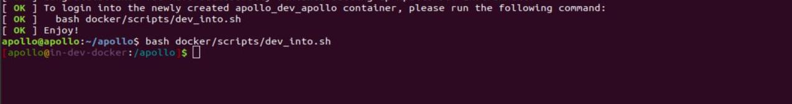

在 docker 环境中执行启动 dreamview 指令。
```
bash scripts/bootstrap.sh 
```
如下图所示，启动成功后，终端串口会显示『Dreamview is running at http://localhost:8888』, 
若出现『Module dreamview is already running - skipping.』提示，则表示上一次运行 Dreamview 
没有正常关闭，Dreamview 仍在运行中，此时可执行关闭 Dreamview 指令，待关闭完成之后， 
重新执行启动 Dreamview 指令即可。

关闭 Dreamview 指令如下：
```
bash scripts/bootstrap.sh stop
```
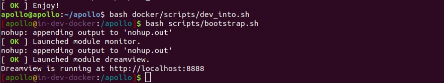
通过浏览器打开网址：http://localhost:8888，可以正常访问页面
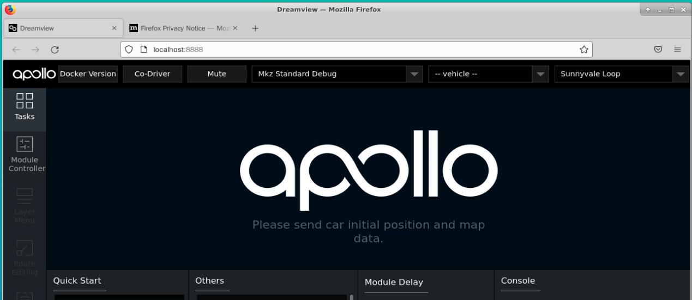
（2）启动sim_control

如下图所示，按照指引完成，选择模式：【Contest Debug】，选择车型：【Mkz Example】，选择地图：【Apollo Map】，开启【Sim Control】开关
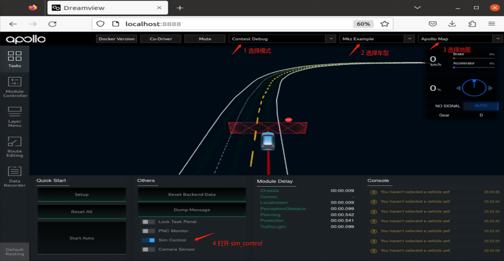
正确选择后，可以在中间区域看到有一辆自动驾驶主车出现。
点击网页端左侧【Module Controller】 栏，启动需要调试的模块进程，如下图所示，我们选择 planning、 prediction、routing 和sim obstacle模块

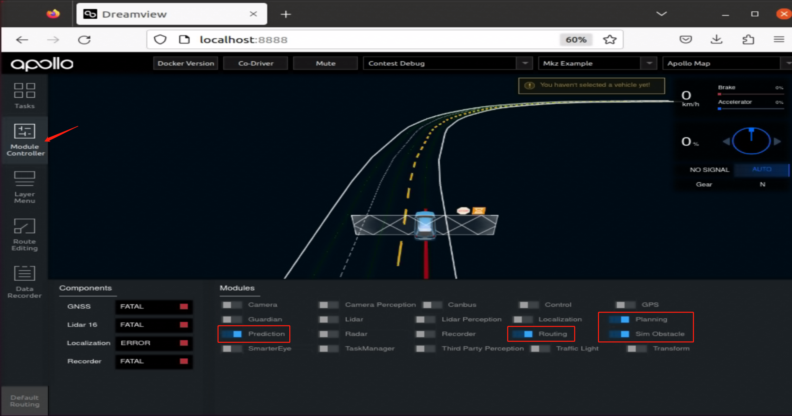

选择左侧的【route editing】可以设置车辆的起始点和出发点。
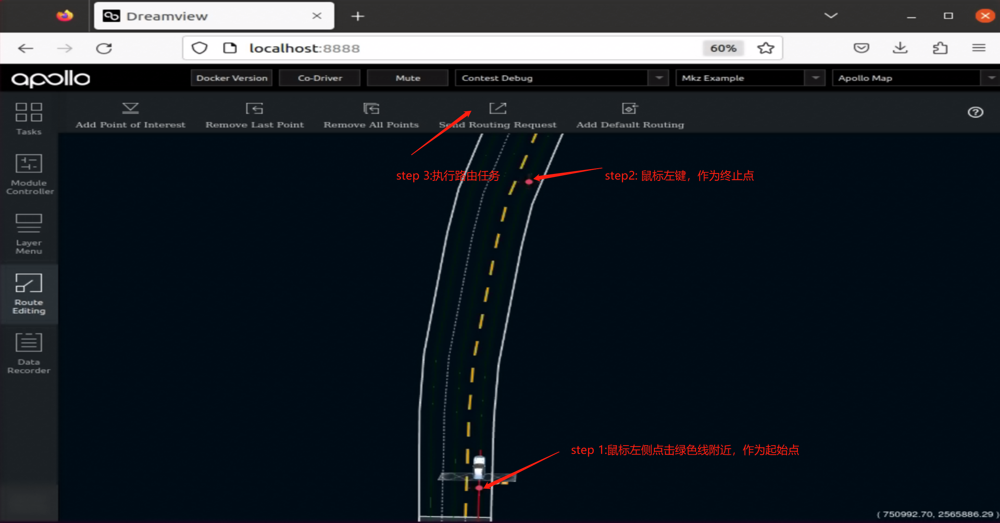

成功后可以看到，自动驾驶车辆能够出现路由（红色细线）以及规划轨迹（青绿色宽色的线），同时车能够在地图中行驶运动。
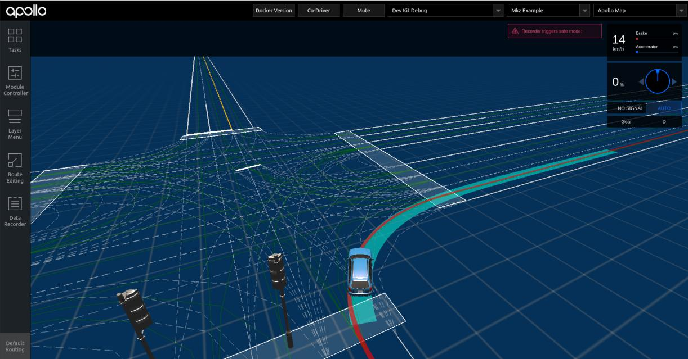
（3）使用``cyber_monitor``查看各模块通道数据
在命令行里面，docker容器环境下执行命令
```
#第一次使用，需要执行
source cyber/setup.bash 
#之后只需要执行
cyber_monitor
```
如下图所示，可以使用光标，前后左右键查看各通道数据。
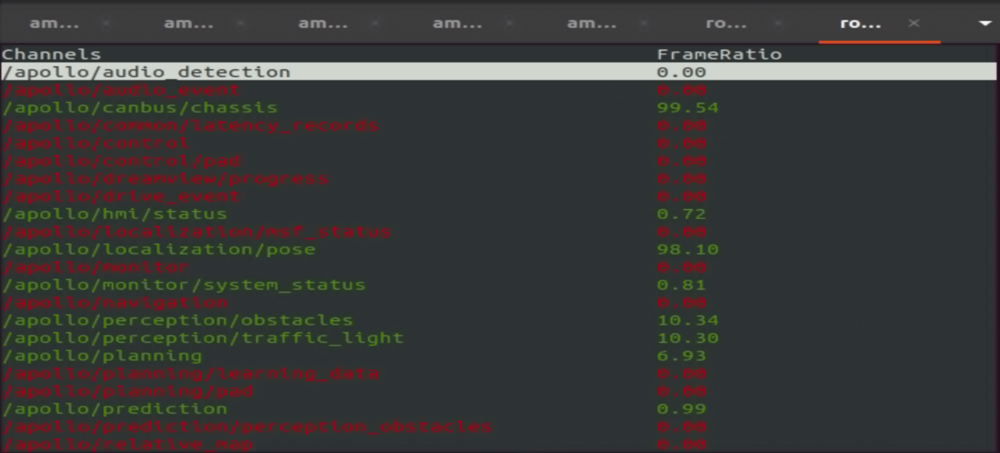

（4）执行障碍物绕行任务
通过地图缩放方式，在下图箭头所指处，可以找到预先设置好的障碍物。
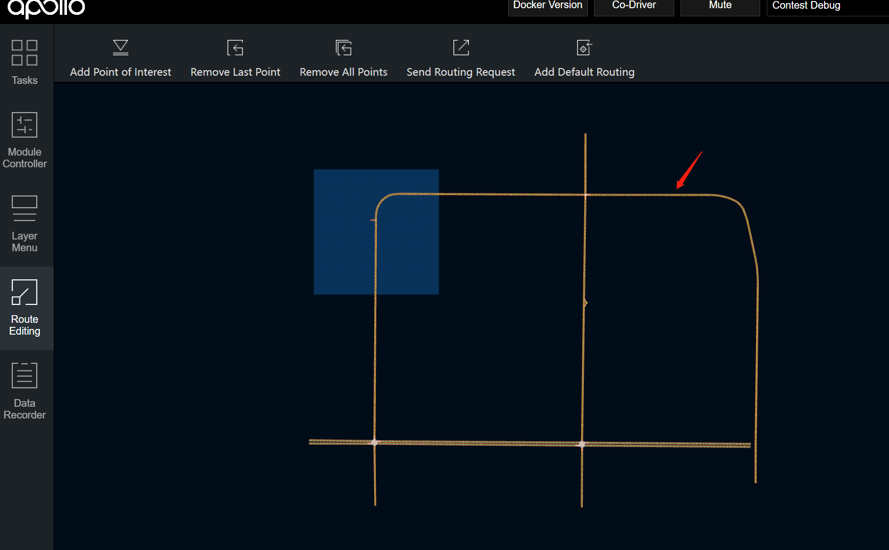

执行一次绕行障碍物的路由请求
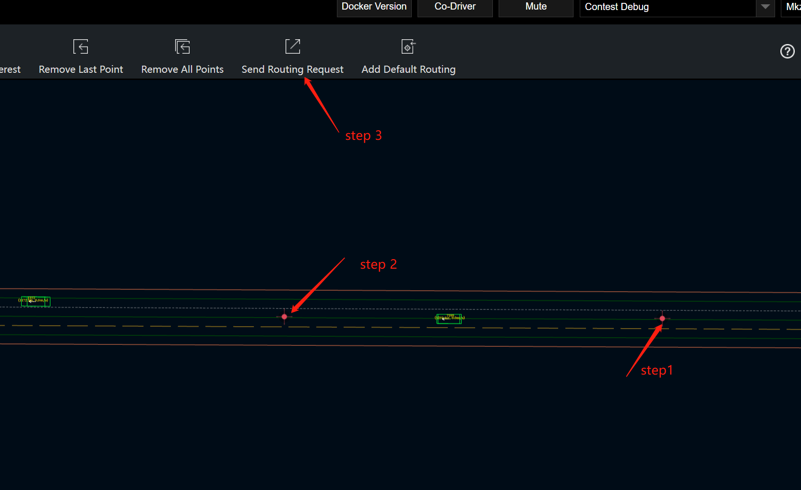

可以看到自动驾驶车辆能够对障碍物进行绕行
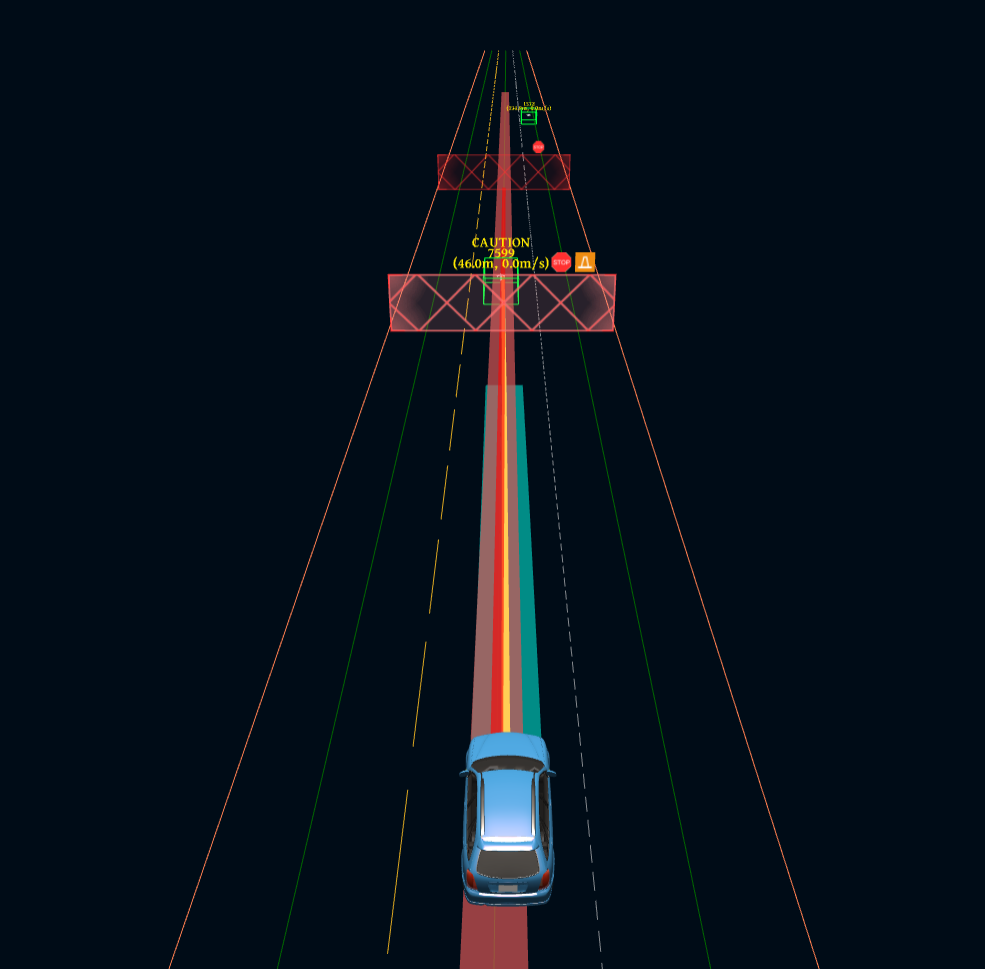

绕行时会出现
<center></center>

（5）sim_control 调试技巧
如下图所示，打开pnc monitor，可以查看自动驾驶各模块具体详细数据以及可视化图表。
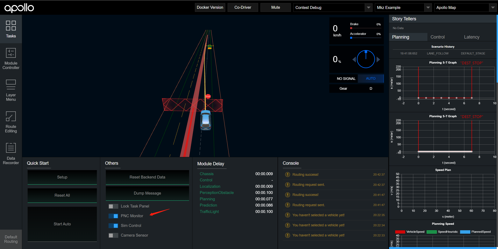

点击任务栏 Route Editing > 点击 Add Default Routing > 在地图上设置起点与终点 > 再次点击 Add Default Routing，在弹出的对话框中为该场景命名，我们为静态障碍物绕行的场景命名为 【nudge】 ，命名完成后点击 save 保存。
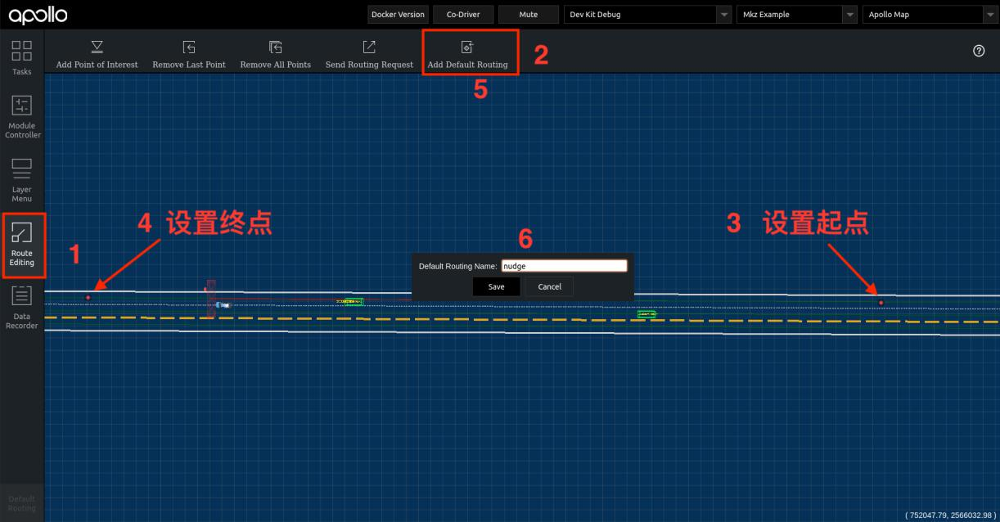

# 任务1：静止障碍物绕行（2学时）

## 实验概述
在任务1-3当中，我们已经掌握了Apollo的基本操作流程。在接下来的实验二至实验五中，我们将选择一些百度Apollo提供的典型仿真测试场景作为实验的主要内容。通过这些实验，我们将深入了解Apollo规划模块的运作方式，并通过适当的代码修改来探索该模块的基本工作原理和代码结构。

在这一系列实验中，我们将不仅仅局限于理论的学习，还将通过实际的代码操作和修改来加深我们对Apollo规划模块的理解。通过对典型仿真测试场景的实际应用，我们将能够更加直观地感受到规划模块在自动驾驶系统中的关键作用。

通过逐步完成这些实验，我们将能够逐渐掌握如何操作Apollo的规划模块，从而在真实道路环境中更好地实现自动驾驶车辆的路径规划和决策过程。

## 实验内容
如下方示意图所示，自动驾驶车辆可以完成静止障碍物的绕行任务。

实验要求：请通过修改Apollo planning相关代码完成：
<center></center>

（1）经过障碍物车速不超过10km/h

（2）经过障碍物时自动驾驶车辆与静止车辆的横向距离不少于1m（自动驾驶车辆与障碍物车辆质心距离不少于3m）


### 具体步骤
1. 在dreamview 地图中找到静止障碍物场景的设置位置（坐标752206.37,2566012.56附近），并通过设置起始点路由，观察默认情况下Apollo对于静止障碍物绕行的情况（重点观察经过静止障碍物时的车速以及与障碍物的横向距离）
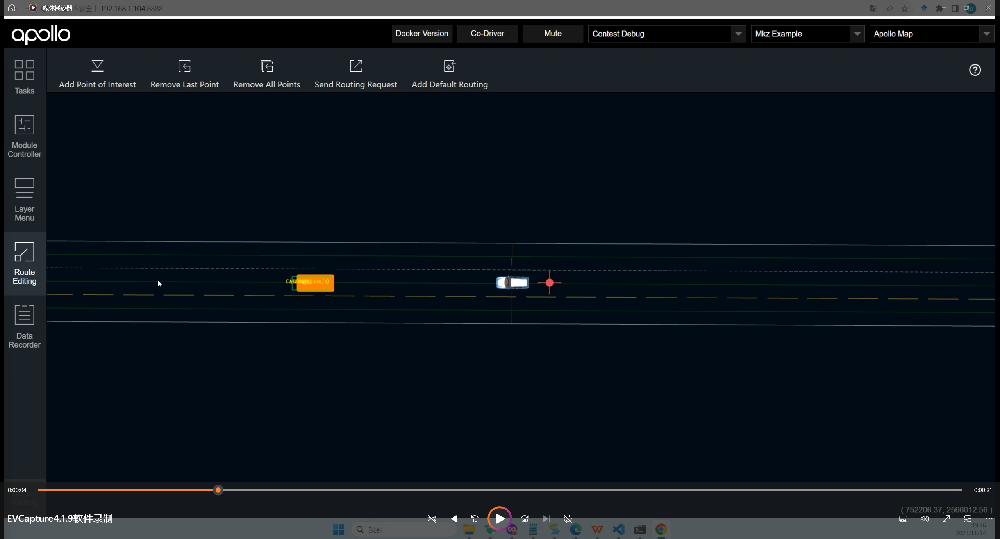
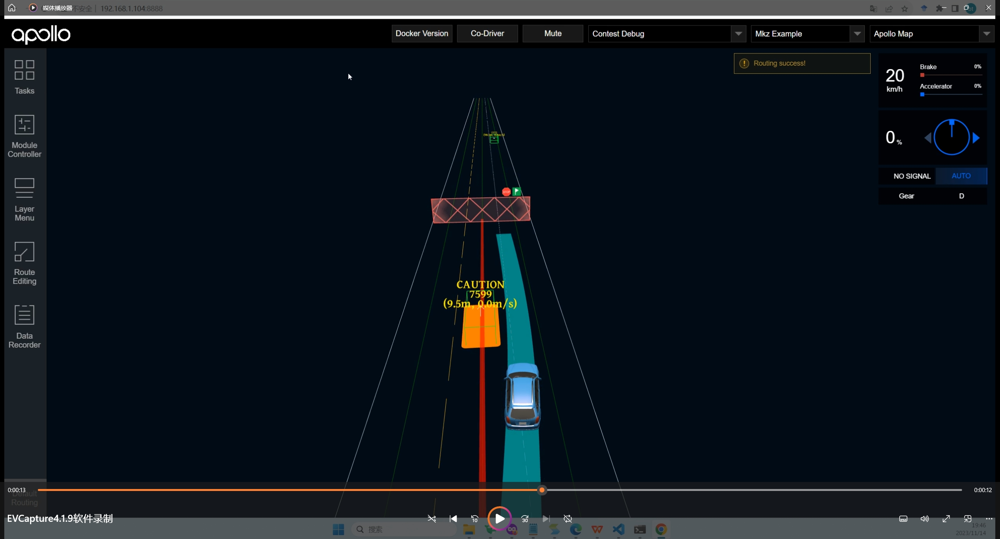
2. 进入Apollo工程根目录，并找到planning配置文件,配置文件所在路径：
```/apollo/modules/planning/conf/planning_config.pb.txt```

3. 在文件中修改配置项`static_obs_nudge_speed_ratio`的值，建议阈值修改为`0.1`
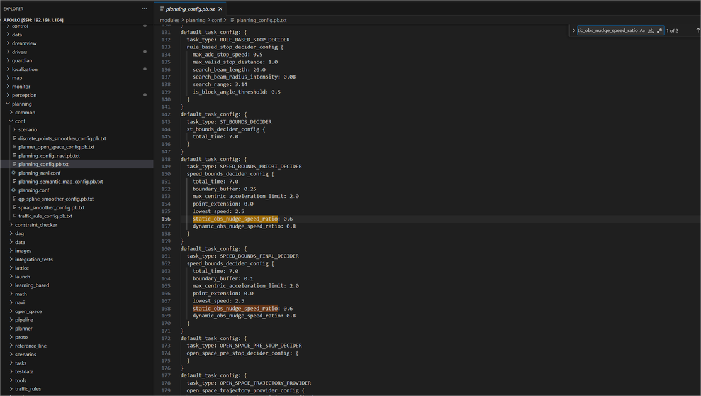

4. 在Apollo工程目录里，找到planning配置项，对应路径：
```/apollo/modules/planning/conf/planning.conf```
在配置文件最后增加配置项：
```--obstacle_lat_buffer=1```
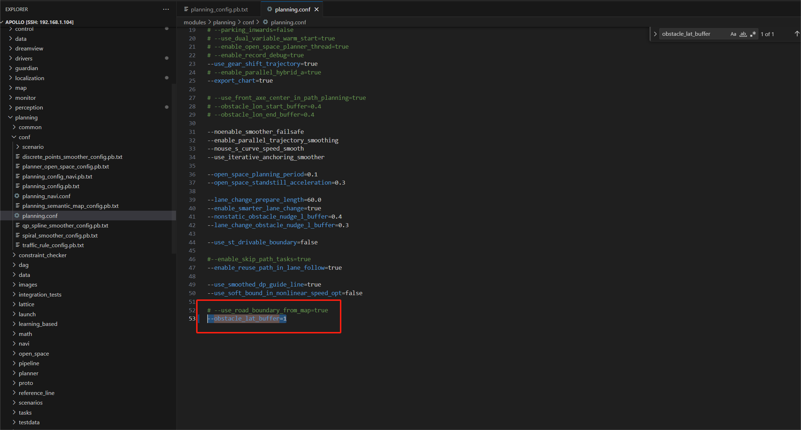
5. 按照任务0中模块开启部分的介绍，在dreamview中【module controller】里关闭并重新开启planning功能模块, 重新设定自动驾驶路由任务，观察自动驾驶修改配置后的表现。
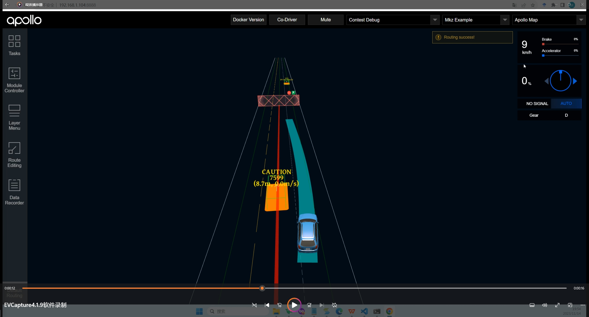

# 任务2：人行横道行人让行（2学时）
## 实验内容
如下方示意图所示，自动驾驶车辆可以在人行横道处等待行人通过。
<center></center>

实验要求：主车向前行驶，前方遇到有人通过人行道，主车需要停止分别在人行道前10m，5m，1m内停车。

### 具体步骤
1. 在dreamview 地图中找到人行横道行人让行场景的设置位置(对应地图左上角区域，坐标750984.72.2565794.57)
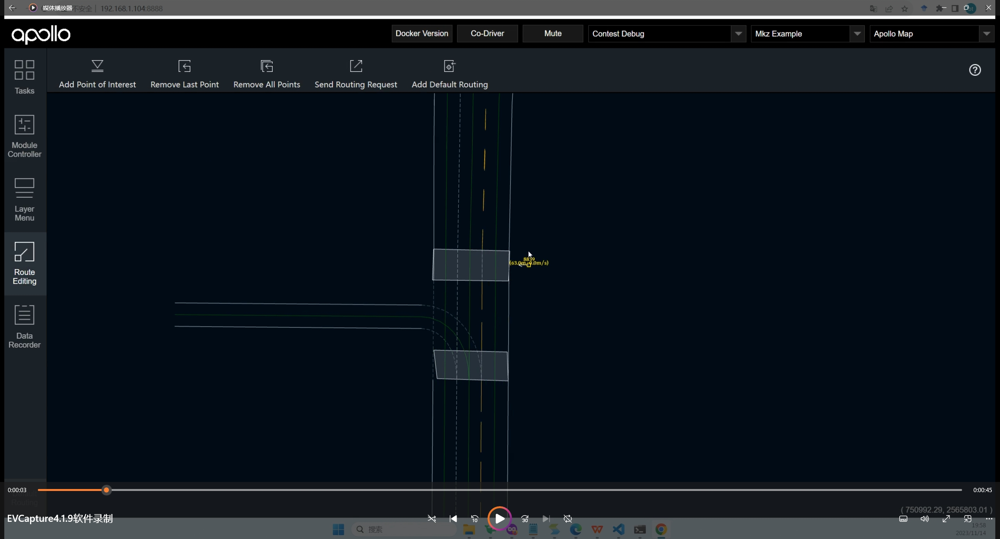
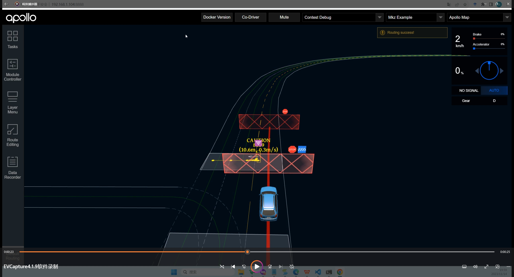
2. 在Apollo工程目录里，找到关于交通规则配置文件对应的路径：
```/apollo/modules/planning/conf/traffic_rule_config.pb.txt```
3. 修改对应配置项，`stop_distance`分别为`1`，`5`以及`10`
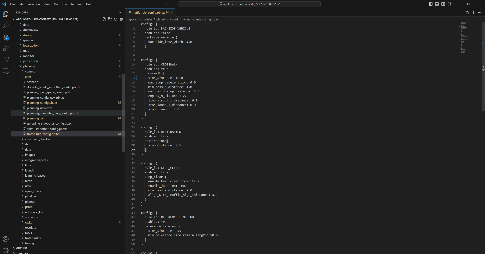
4. 按照任务0中模块开启部分的介绍，在dreamview中【module controller】里关闭并重新开启planning功能模块, 重新设定自动驾驶路由任务，观察自动驾驶修改配置后的表现。
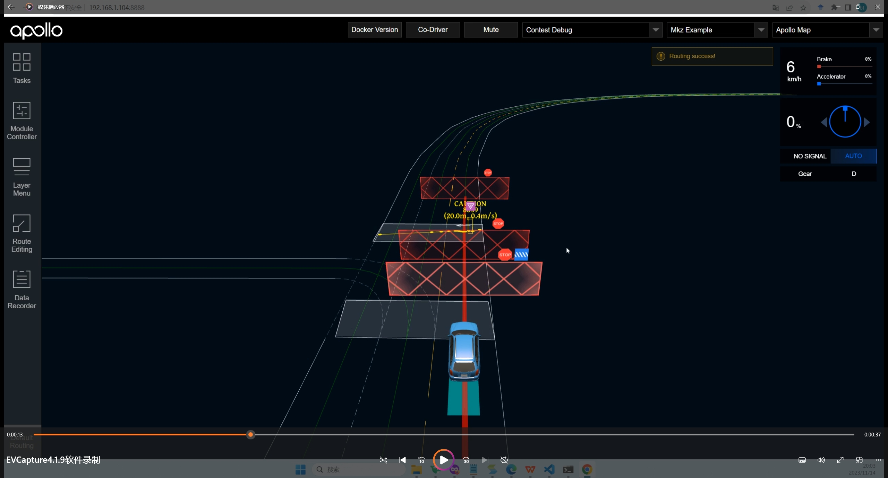
# 任务3：慢速车绕行 （2学时）
## 实验内容
如下方示意图所示，自动驾驶车辆需要根据前方慢行车辆状态，执行对应不同决策。

<center></center>

实验要求：当前方车辆速度大于3 m/s 时，自动驾驶主车选择跟随前车行驶；当前方车速度小于3m/s，自动驾驶主车选择对前车绕行。
### 具体步骤
1. 在dreamview 地图中找到慢速车绕行场景的设置位置(对应地图右侧区域，坐标754106.67,2565052.38)

跟车时状态:

<center></center>

2. 在Apollo工程目录里，找到planning配置项，对应路径：
```/apollo/modules/planning/conf/planning.conf```
在配置文件最后增加配置项：
```
--static_obstacle_speed_threshold=3.0
--obstacle_lat_buffer=1.50
```
3. 在Apollo工程目录里，找到关于planning的源码，对应路径：
```
/apollo/modules/planning/tasks/deciders/utils/path_decider_obstacle_utils.cc 
```
代码第39行，修改判断逻辑：
```
if (!obstacle.IsStatic() ||
      obstacle.speed() > FLAGS_static_obstacle_speed_threshold) {
    return false;
  }
```
去掉`!obstacle.IsStatic()`,修改为：
```
if (obstacle.speed() > FLAGS_static_obstacle_speed_threshold) {
    return false;
  }
```
4. 执行完上述操作，需要重新编译源码。在根目录下，重新执行一次代码编译：
```
./apollo.sh build
```
并使用命令重启dreamview
```
root@in-dev-docker:/apollo# ./scripts/bootstrap.sh restart
```
5. 重新执行慢速车绕行场景路由任务

<center></center>
